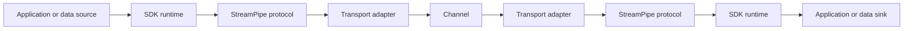

# SPSS-000 — Overview

| Field | Value |
| --- | --- |
| Status | Draft |
| Category | Standards Track |
| Depends on | SPSS-000A, SPSS-000B |
| Updates | None |
| Last updated | 2026-07-23 |

## Abstract

StreamPipe is a protocol and SDK ecosystem for streaming structured datasets and messages with bounded memory use. A StreamPipe client and server may use different programming languages and transports while sharing the same session, framing, data-model, and flow-control semantics.

## Scope

This overview defines the product boundary and high-level architecture. It does not reserve wire values, specify byte layouts, or prescribe public SDK method signatures.

## Problem statement

Many data APIs materialize large collections in memory, use serializer-specific payloads, or tie client interoperability to a server runtime. StreamPipe separates four concerns: transport, protocol, format, and runtime integration.

## Goals

`REQ-OVERVIEW-001` — A StreamPipe session **MUST** have protocol semantics independent of its transport adapter.

`REQ-OVERVIEW-002` — A conforming implementation **MUST** allow incremental production and consumption of stream data.

`REQ-OVERVIEW-003` — The protocol **MUST** support deterministic failure and cancellation semantics.

`REQ-OVERVIEW-004` — The specification **MUST** permit independent SDK implementations in multiple languages.

`REQ-OVERVIEW-005` — Core protocol semantics **MUST NOT** depend on a .NET-specific concept such as `PipeReader`, `PipeWriter`, `IDataReader`, or `IAsyncEnumerable<T>`.

## Non-goals

The first protocol version does not standardize distributed query planning, a universal database type system, cross-region routing, persistent messaging, or a mandatory columnar format. SDKs may offer native adapters, but such adapters are not wire protocol concepts.

## Architecture model

The protocol layer is common to all SDKs. SDK runtimes adapt their language’s async I/O primitives to the protocol layer. For .NET, intended adapters include `System.IO.Pipelines`, `DbDataReader`, and `IAsyncEnumerable<T>`; other SDKs use their native idioms while preserving protocol semantics.

## Compatibility considerations

Compatibility is negotiated at the protocol level, never inferred from an SDK package version. Specific negotiation rules are deferred to SPSS-150.

## Security considerations

Implementations must consider input size limits, cancellation propagation, and malformed or malicious frames. Authentication and encryption are layered concerns until a later SPSS document specifies their protocol interaction.

## Performance considerations

StreamPipe targets memory bounded by configured windows, batches, and implementation buffers rather than total stream length. It does not promise end-to-end zero-copy because transports, runtimes, and serializers can require copies.

## References

- [SPSS-000A](SPSS-000A-Project-Charter.md)
- [SPSS-000B](SPSS-000B-Document-Conventions.md)
- [SPSS-001](SPSS-001-Glossary.md)
