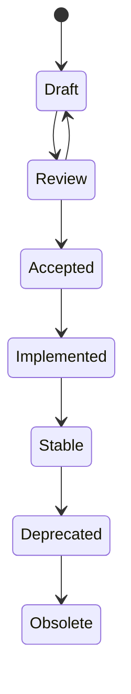

# SPSS-000A — Project Charter

| Field | Value |
| --- | --- |
| Status | Draft |
| Category | Governance |
| Depends on | None |
| Updates | None |
| Last updated | 2026-07-23 |

## Abstract

StreamPipe is an open specification and SDK ecosystem for transferring structured data as bounded-memory streams. This charter establishes the project’s purpose, scope, governance, and standards-development rules. It is authoritative for the project process, but it does not define an on-wire protocol.

## Vision and mission

The vision is interoperable high-volume data streaming across programming languages and transports without requiring a particular database, cloud provider, runtime, or serialization implementation.

The mission is to publish a precise, testable protocol specification and enable independently developed SDKs that conform to it.

## Scope

The project defines a language-independent streaming protocol; session, framing, schema, flow-control, and error semantics; and conformance requirements for client, server, transport, and serialization SDKs.

## Out of scope

StreamPipe is not an ORM, query language, database, message broker, service discovery system, or general-purpose RPC framework. It does not require Apache Arrow, HTTP, .NET, or a specific authentication provider.

## Guiding principles

`REQ-CHARTER-001` — The protocol **MUST** be language independent.

`REQ-CHARTER-002` — A conforming SDK **MUST NOT** redefine protocol behavior.

`REQ-CHARTER-003` — A stream implementation **MUST NOT** require buffering the complete logical payload before producing or consuming data.

`REQ-CHARTER-004` — Protocol features **MUST** have deterministic conformance criteria.

`REQ-CHARTER-005` — Transport-specific behavior **MUST** be isolated from core protocol semantics unless an SPSS document explicitly defines the interaction.

## Specification lifecycle

Only `Accepted`, `Implemented`, `Stable`, `Deprecated`, and `Obsolete` SPSS documents define published project decisions. A `Draft` may guide discussion but is not a compatibility guarantee.

## Change process

An editorial change may clarify wording without changing meaning. Any change that affects wire bytes, required behavior, compatibility, data ownership, security, or observable SDK behavior is semantic. A semantic change **MUST** identify affected requirement IDs and include compatibility analysis. Material architectural decisions **MUST** be recorded in an ADR.

## Conformance

An implementation may claim conformance only for a named protocol version and only after it satisfies every applicable accepted requirement. It **MUST NOT** describe a planned, partial, or incompatible implementation as conforming.

## Security considerations

Specifications must consider denial of service, malformed input, authentication boundaries, integrity, confidentiality, resource exhaustion, and cross-tenant data exposure.

## Performance considerations

Bounded memory is a design requirement, not a guarantee of zero allocation or fixed latency. Concrete allocation, throughput, and batch-size targets are defined by later SPSS documents and benchmark suites.

## References

- RFC 2119 — Key words for use in RFCs to Indicate Requirement Levels
- RFC 8174 — Ambiguity of Uppercase vs Lowercase in RFC 2119 Key Words
- [GOVERNANCE.md](../../GOVERNANCE.md)
