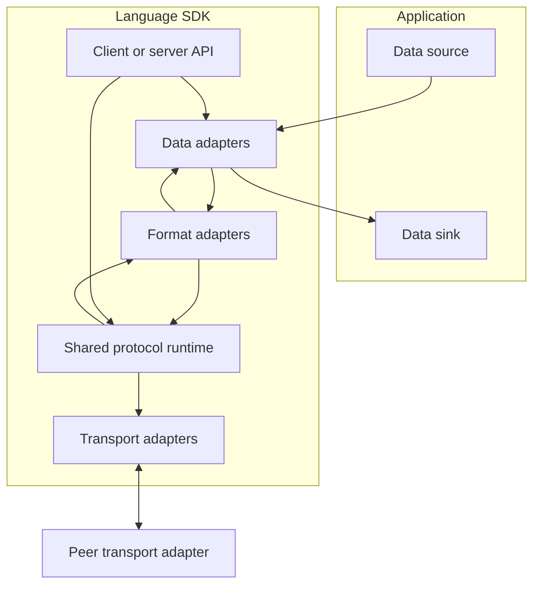
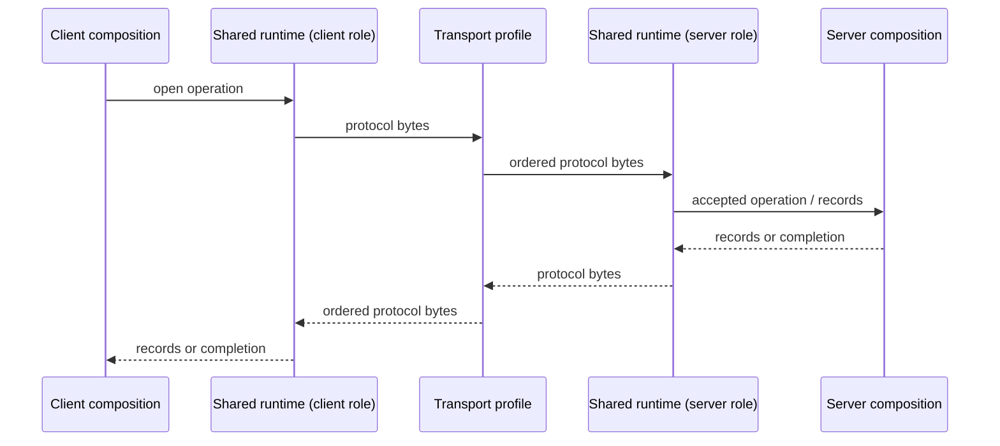
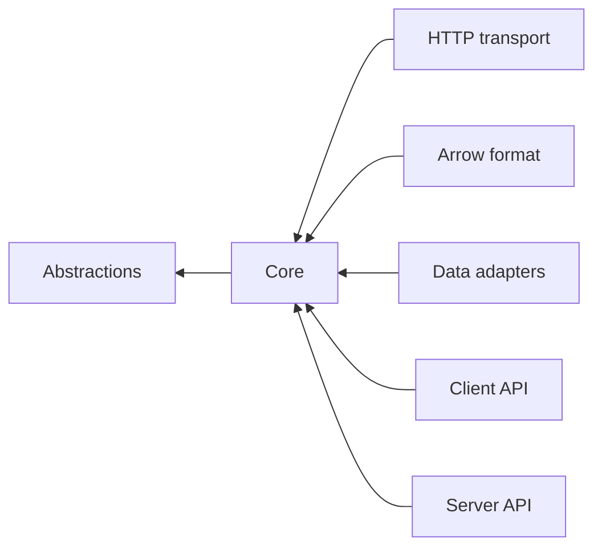

# SPSS-010 — Architecture

| Field | Value |
| --- | --- |
| Status | Draft |
| Category | Standards Track |
| Depends on | SPSS-000A, SPSS-000B, SPSS-000, SPSS-001 |
| Updates | None |
| Last updated | 2026-07-23 |

## Abstract

This document defines the StreamPipe component model, its dependency rules, and the boundary between the language-independent protocol and language-specific SDKs. It establishes a shared runtime model: a client and server implementation in the same language use the same protocol runtime and differ only in endpoint role and transport integration.

## Scope

This document specifies architecture and responsibility boundaries. It does not define the data schema, the on-wire frame layout, concrete transport profiles, or a complete public API. Those are specified in later documents.

## Architectural principles

`REQ-ARCH-001` — A StreamPipe implementation **MUST** separate transport adaptation, protocol execution, payload format handling, and application data adaptation.

`REQ-ARCH-002` — Core protocol execution **MUST NOT** depend on a particular transport, database provider, serialization library, or application domain model.

`REQ-ARCH-003` — A transport adapter **MUST NOT** interpret application data or redefine session, frame, flow-control, or error semantics.

`REQ-ARCH-004` — A payload-format adapter **MUST NOT** own network connection, transport retry, or endpoint lifecycle behavior.

`REQ-ARCH-005` — A client and server SDK for the same language **MUST** share one protocol runtime implementation.

`REQ-ARCH-006` — Each adapter boundary **MUST** make ownership and cancellation propagation explicit.

## Component model

### Application layer

The application layer owns business behavior, credentials, data-query intent, and destination policy. It may produce records, consume records, or expose native sources such as `DbDataReader`. It is not required to understand frames or transport buffers.

`REQ-ARCH-007` — An application-facing API **MUST NOT** require callers to construct protocol frames for ordinary streaming operations.

### Data adapter layer

Data adapters map a language-native source or sink to the logical record model. Examples include a .NET `DbDataReader` source adapter, an `IAsyncEnumerable<T>` source adapter, and a bulk-ingest sink adapter.

`REQ-ARCH-008` — A data adapter **MUST** consume or produce records incrementally.

`REQ-ARCH-009` — A data adapter **MUST NOT** require materializing all records in order to start streaming, except when an explicitly negotiated format requires bounded initialization data.

### Format adapter layer

Format adapters encode or decode logical records and schema information to a negotiated payload format. Apache Arrow IPC is a planned format adapter; it is not the StreamPipe wire protocol.

`REQ-ARCH-010` — A format adapter **MUST** expose only format-level behavior to the core runtime.

`REQ-ARCH-011` — The protocol runtime **MUST** be able to select a format adapter through negotiated capabilities rather than compile-time transport coupling.

### Shared protocol runtime

The shared runtime owns the endpoint role, session state, ordering, flow-control coordination, cancellation, timeout translation, frame dispatch, and protocol errors. It is used by both client and server composition APIs.

`REQ-ARCH-012` — The shared runtime **MUST** be the single authority for protocol session state transitions.

`REQ-ARCH-013` — The shared runtime **MUST** prevent application data from being delivered after terminal session failure, except for diagnostics explicitly permitted by a later SPSS document.

`REQ-ARCH-014` — The shared runtime **MUST** propagate cancellation to adapters and stop accepting new application data after cancellation is observed.

### Transport adapter layer

Transport adapters move ordered bytes between a channel and the shared runtime. HTTP, TCP, named pipes, gRPC, WebSocket, and Arrow Flight can each receive a transport profile when their semantics have been specified.

`REQ-ARCH-015` — A transport adapter **MUST** preserve byte order within one StreamPipe session.

`REQ-ARCH-016` — A transport adapter **MUST** surface transport closure, read failure, write failure, and cancellation to the shared runtime.

`REQ-ARCH-017` — A transport adapter **MUST NOT** hide unbounded outbound buffering behind a successful write result.

## Roles and shared runtime

The client and server are session roles, not separate protocol engines. Both construct the same runtime with a role-specific session policy and a transport adapter.

`REQ-ARCH-018` — Client and server composition APIs **MUST NOT** fork protocol state-machine logic.

`REQ-ARCH-019` — Role-specific policy **MUST** be represented as data, configuration, or a narrowly scoped role abstraction; it **MUST NOT** duplicate the shared runtime.

## Dependency rules

The dependency direction is from outer integration layers toward the shared abstractions and core. No core project may reference an outer transport, payload-format, database, or web-framework project.

`REQ-ARCH-020` — The core runtime **MUST** depend only on StreamPipe abstractions and runtime libraries required for its language implementation.

`REQ-ARCH-021` — A format or transport package **MUST NOT** reference a client or server composition package.

`REQ-ARCH-022` — A data adapter package **MUST NOT** reference a concrete transport package.

## .NET project mapping

The following mapping defines the initial .NET repository layout. It is a packaging plan, not a wire protocol definition.

| Project | Responsibility | Allowed dependencies |
| --- | --- | --- |
| `StreamPipe.Abstractions` | Stable public contracts, option types, errors, schema-facing contracts | BCL only |
| `StreamPipe.Core` | Shared runtime, session coordination, protocol state machines | Abstractions, BCL |
| `StreamPipe.Protocols.Arrow` | Arrow IPC payload-format adapter | Abstractions, Arrow dependency |
| `StreamPipe.Transports.Http` | ASP.NET Core and `HttpClient` transport adapters | Abstractions, Core, ASP.NET Core |
| `StreamPipe.Client` | Client composition and dependency-injection entry points | Abstractions, Core, optional adapters |
| `StreamPipe.Server` | Server composition and dependency-injection entry points | Abstractions, Core, optional adapters |

`REQ-ARCH-023` — `StreamPipe.Abstractions` **MUST NOT** reference ASP.NET Core, Apache Arrow, a database provider, or a concrete transport implementation.

`REQ-ARCH-024` — `StreamPipe.Core` **MUST NOT** reference ASP.NET Core, Apache Arrow, or a database provider.

`REQ-ARCH-025` — .NET transport implementations **MUST** use asynchronous I/O and propagate `CancellationToken` through the complete I/O path.

`REQ-ARCH-026` — A .NET HTTP adapter **SHOULD** use `HttpRequest.BodyReader` and `HttpResponse.BodyWriter` where the host provides them; this is an adapter optimization and not a protocol requirement.

## Extensibility

New transports, formats, and data adapters may be added without changing the core protocol semantics. A feature that changes negotiation, framing, session state, or observable interoperability requires a new or updated SPSS document.

`REQ-ARCH-027` — An extension **MUST** declare the capabilities, limits, and compatibility impact it introduces.

`REQ-ARCH-028` — An extension **MUST NOT** cause a peer that does not support it to misinterpret a session as conforming.

## Compatibility considerations

The component boundaries are compatible with the planned first implementation. Moving a responsibility across boundaries is a semantic architecture change and requires an ADR. Adding a new outer adapter is compatible if it conforms to all existing core semantics.

## Security considerations

Transport adapters define a security boundary and must surface authentication and channel-security outcomes to composition layers without allowing untrusted data to bypass protocol validation. Format and data adapters must treat payload metadata and record values as attacker-controlled until a deployment’s trust policy establishes otherwise.

## Performance considerations

Bounded memory is achieved cooperatively: the transport must expose write pressure; the core must coordinate flow control; formats must process bounded batches; and data adapters must avoid full materialization. No layer may compensate for a slow downstream peer through an unbounded queue.

## References

- [SPSS-000 — Overview](SPSS-000-Overview.md)
- [SPSS-001 — Glossary](SPSS-001-Glossary.md)
- [SPSS-020 — Data Model](SPSS-020-Data-Model.md) (planned)
- [SPSS-030 — Memory Model](SPSS-030-Memory-Model.md) (planned)
- [SPSS-040 — Public API](SPSS-040-Public-API.md) (planned)
