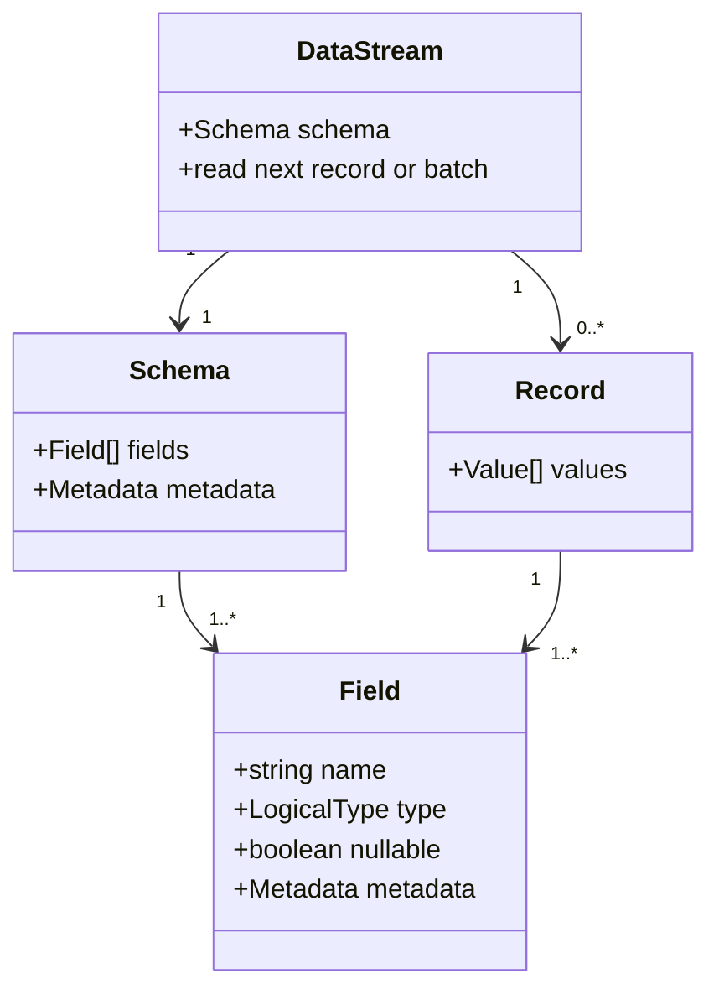

# SPSS-020 — Data Model

| Field | Value |
| --- | --- |
| Status | Draft |
| Category | Standards Track |
| Depends on | SPSS-000, SPSS-001, SPSS-010 |
| Updates | None |
| Last updated | 2026-07-23 |

## Abstract

This document defines the language-independent logical data model exchanged through StreamPipe. The model consists of schemas, fields, logical types, records, and batches. It deliberately separates logical data from on-wire framing and concrete payload formats such as Apache Arrow IPC.

## Scope

This document specifies the logical data contract presented to data and format adapters. It does not specify binary encodings, field IDs on the wire, schema negotiation frames, or language-specific APIs.

## Model overview



## Schema

A schema is an ordered collection of fields plus optional metadata. Field order is significant. Metadata is a set of UTF-8 string keys and values and is not a substitute for a protocol feature or a type-system extension.

`REQ-DATA-001` — A schema **MUST** define at least one field.

`REQ-DATA-002` — A schema **MUST** preserve field order.

`REQ-DATA-003` — Field names **MUST** be unique within one schema under byte-for-byte UTF-8 comparison.

`REQ-DATA-004` — Schema metadata **MUST NOT** change the meaning of a core logical type unless a later SPSS document explicitly defines that metadata key.

## Field

A field has a name, a logical type, a nullability flag, and optional metadata. A field is nullable when a record may contain the null value for that field. Null is distinct from an empty string, an empty byte sequence, a numeric zero, and a missing field.

`REQ-DATA-005` — Each field **MUST** declare one logical type and one nullability value.

`REQ-DATA-006` — A non-nullable field **MUST NOT** accept a null logical value.

`REQ-DATA-007` — An implementation **MUST NOT** use a sentinel application value to represent null unless the field’s logical type explicitly defines that sentinel in a later SPSS document.

## Logical types

The initial logical type families are shown below. Exact ranges, precision, and payload encodings are defined in SPSS-130 and an applicable format specification.

| Family | Types |
| --- | --- |
| Boolean | `Boolean` |
| Signed integer | `Int8`, `Int16`, `Int32`, `Int64` |
| Unsigned integer | `UInt8`, `UInt16`, `UInt32`, `UInt64` |
| Floating point | `Float32`, `Float64` |
| Decimal | `Decimal(precision, scale)` |
| Text | `Utf8` |
| Binary | `Binary` |
| Temporal | `Date`, `Time`, `Timestamp`, `Duration` |
| Identifier | `Uuid` |
| Nested | `List`, `Struct`, `Map` |

`REQ-DATA-008` — A logical type **MUST** be declared by the schema before its values are streamed.

`REQ-DATA-009` — A format adapter **MUST** reject or report unsupported logical types before delivering records that cannot be represented faithfully.

`REQ-DATA-010` — Decimal, temporal, and nested-type parameters **MUST** be preserved without lossy conversion.

## Records and batches

A record is an ordered sequence of values that conforms to exactly one schema. A batch is an ordered, bounded sequence of records that share a schema. Batches are processing units; they do not alter record order.

`REQ-DATA-011` — A record **MUST** contain exactly one value position for every schema field.

`REQ-DATA-012` — Value position `n` **MUST** conform to schema field position `n`.

`REQ-DATA-013` — A producer **MUST** preserve record order within a stream unless a later operation explicitly specifies reordering.

`REQ-DATA-014` — A batch **MUST** have a finite, implementation-enforced upper bound on records or bytes.

`REQ-DATA-015` — A consumer **MUST** be able to process one batch without requiring future batches.

## Data stream

A data stream pairs a stable schema with an ordered sequence of zero or more records or batches. It may complete successfully, complete with an error, or be cancelled. An empty stream is valid if its schema is available.

`REQ-DATA-016` — A data stream **MUST** make its schema available before delivering its first record.

`REQ-DATA-017` — A data stream **MUST NOT** deliver a record after it completes, fails, or is cancelled.

`REQ-DATA-018` — A data stream **MUST** distinguish successful completion from failure and cancellation.

`REQ-DATA-019` — A consumer **MUST** be allowed to stop consumption before successful completion; the transport and core runtime must then apply the cancellation rules defined by SPSS-120.

### .NET mapping (informative)

The .NET SDK will expose this model through a streaming abstraction aligned with the following shape:

```csharp
public interface IDataStream : IAsyncDisposable
{
    DataSchema Schema { get; }
    ValueTask<bool> ReadAsync(CancellationToken cancellationToken);
    ReadOnlySpan<ColumnValue> Current { get; }
}
```

The interface is informative until SPSS-040 defines the public API. Its `ReadAsync` behavior maps to the logical record order defined above; `Current` represents one record and is valid only after a successful read.

## Schema evolution

A stream schema is immutable for its lifetime. Schema evolution occurs between streams or through a future, explicitly negotiated protocol extension; it never occurs silently within one stream.

`REQ-DATA-020` — A producer **MUST NOT** add, remove, reorder, rename, or change the type or nullability of a field within an active stream.

`REQ-DATA-021` — A consumer **MUST** reject a mid-stream schema change unless it has negotiated a later SPSS-defined schema-evolution extension.

## Compatibility considerations

Adding a type family, changing type parameters, or defining a metadata key is compatible only when capability negotiation lets older peers reject it safely. A change to field order, nullability, or logical type is incompatible for an active stream.

## Security considerations

Schema names, metadata, text, binary values, nested lengths, decimal precision, and batch sizes may be attacker controlled. Implementations must impose configured limits before allocating or recursively traversing data.

## Performance considerations

Data adapters and format adapters should process records in bounded batches. Columnar formats may retain data differently from row-oriented adapters, but both must honor the batch and flow-control limits defined by the session.

## References

- [SPSS-001 — Glossary](SPSS-001-Glossary.md)
- [SPSS-010 — Architecture](SPSS-010-Architecture.md)
- [SPSS-030 — Memory Model](SPSS-030-Memory-Model.md) (planned)
- [SPSS-040 — Public API](SPSS-040-Public-API.md) (planned)
- [SPSS-120 — Streaming Model](SPSS-120-Streaming-Model.md) (planned)
- [SPSS-130 — Type System](SPSS-130-Type-System.md) (planned)
