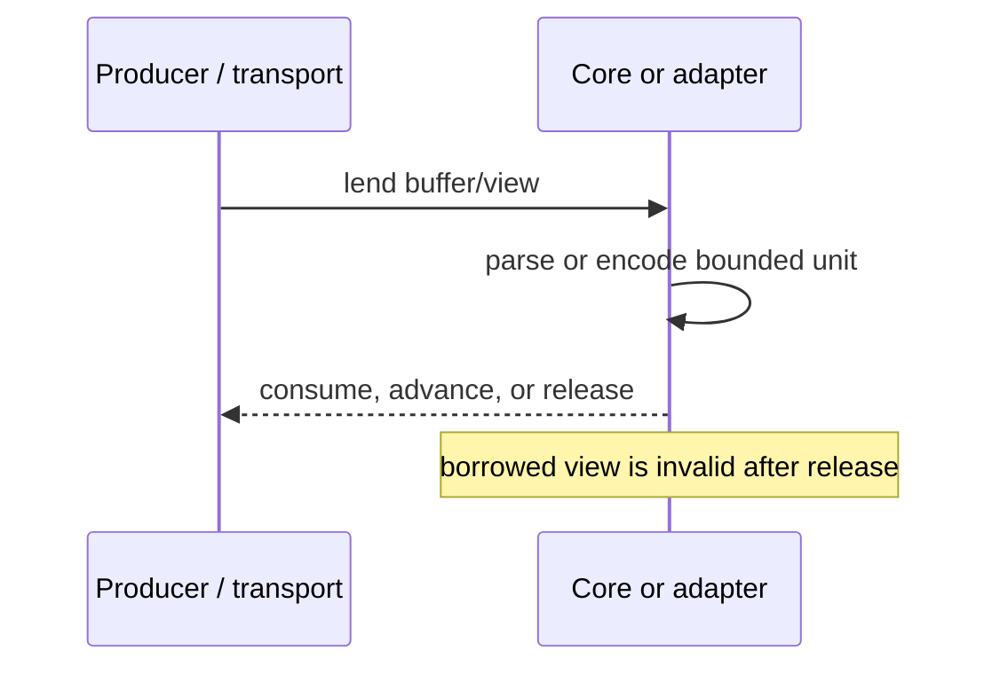

# SPSS-030 — Memory Model

| Field | Value |
| --- | --- |
| Status | Draft |
| Category | Standards Track |
| Depends on | SPSS-001, SPSS-010, SPSS-020 |
| Updates | None |
| Last updated | 2026-07-23 |

## Abstract

This document defines StreamPipe’s bounded-memory model. It establishes ownership, lifetime, batching, flow-control, and cancellation requirements that keep memory proportional to configured limits rather than total stream length.

## Scope

This document defines resource behavior for implementations and adapters. It does not prescribe a single allocator, byte-buffer type, or exact default limit.

## Core principle

Bounded memory means that, for a configured session, retained data is bounded by known limits: transport buffers, in-flight flow-control window, active batch, decoder state, and implementation overhead. It does not mean zero allocation, zero copies, or a constant number of bytes across all configurations.

`REQ-MEM-001` — An implementation **MUST** keep retained stream-data memory bounded independently of the total record count and total payload length.

`REQ-MEM-002` — Every unbounded input dimension that can retain memory **MUST** have a configured or negotiated upper limit.

`REQ-MEM-003` — An implementation **MUST NOT** buffer an entire logical stream solely to serialize, deserialize, retry, or inspect it.

## Ownership and lifetime

Every buffer has one owner at a time. Borrowed views are valid only for their stated lifetime. An adapter may transfer ownership explicitly; otherwise, the producer retains ownership and the consumer must not retain a view after the callback, read iteration, or batch completion that exposed it.

`REQ-MEM-004` — A component **MUST** document whether it borrows, owns, or transfers each buffer it exposes.

`REQ-MEM-005` — A consumer **MUST NOT** access a borrowed buffer after returning it, advancing past it, completing its read, or otherwise ending its documented lifetime.

`REQ-MEM-006` — An ownership transfer **MUST** have exactly one releasing party, including on cancellation and error paths.

`REQ-MEM-007` — Implementations **MUST** release owned pooled buffers promptly when a session reaches any terminal state.

## Limits

An implementation must set limits for at least: maximum frame payload, maximum schema metadata size, maximum nesting depth, maximum record or batch size, maximum in-flight bytes, and maximum queued application work. Protocol-specific values and negotiation are deferred to SPSS-100 and SPSS-120.

`REQ-MEM-008` — An implementation **MUST** reject, fail, or cancel an input that exceeds an applicable resource limit before allocating unbounded additional memory.

`REQ-MEM-009` — A limit failure **MUST** be distinguishable from successful completion.

`REQ-MEM-010` — Configured limits **MUST** be observable in diagnostics without exposing sensitive payload values.

## Batches and records

Batches are the primary application-facing memory boundary. A format adapter may internally process data in chunks, but it must not expose a batch larger than the active configured batch limit.

`REQ-MEM-011` — A producer **MUST** stop reading from its upstream source when the active batch or in-flight window has reached its limit.

`REQ-MEM-012` — A consumer **MUST** release or consume a batch before requesting enough subsequent data to exceed its declared memory budget.

`REQ-MEM-013` — A data adapter **MUST NOT** create a `List<T>` or equivalent full-stream collection as a required part of normal streaming operation.

## Backpressure

Backpressure propagates from the slowest downstream consumer to its upstream producer. A write that would exceed a transport or session limit must await available capacity, fail, or cancel; it must not silently accumulate an unbounded queue.

`REQ-MEM-014` — A transport adapter **MUST** expose downstream write pressure to the core runtime.

`REQ-MEM-015` — The core runtime **MUST** delay upstream production when downstream capacity is unavailable.

`REQ-MEM-016` — An adapter **MUST NOT** replace backpressure with unbounded task, message, or byte queues.

`REQ-MEM-017` — Cancellation **MUST** unblock pending reads or writes within the guarantees of the underlying runtime.

## .NET adaptation

In .NET, `System.IO.Pipelines` is the preferred transport-adapter mechanism. `PipeReader` produces a `ReadOnlySequence<byte>` whose lifetime ends when the adapter calls `AdvanceTo`; `PipeWriter` makes written bytes eligible for transport only after `Advance` and `FlushAsync`.

`REQ-MEM-018` — A .NET adapter using `PipeReader` **MUST** call `AdvanceTo` after it has consumed or examined a read buffer.

`REQ-MEM-019` — A .NET adapter **MUST NOT** retain `ReadOnlySequence<byte>`, `ReadOnlyMemory<byte>`, or `Span<byte>` views beyond the documented pipeline lifetime.

`REQ-MEM-020` — A .NET adapter using `PipeWriter` **MUST** await `FlushAsync` according to its configured flush threshold or before completion.

`REQ-MEM-021` — A .NET adapter **MUST** observe `FlushResult.IsCanceled` and `FlushResult.IsCompleted` and terminate or transition the session accordingly.

`REQ-MEM-022` — `MemoryPool<byte>` or `ArrayPool<byte>` **MAY** be used; pooled buffers **MUST** be returned exactly once.

## Copy and allocation policy

Copies are permitted when required for framing, encryption, compression, format conversion, or lifetime isolation. Implementations should minimize copies and transient allocations, but correctness and ownership safety take priority.

`REQ-MEM-023` — An optimization **MUST NOT** expose mutable or invalid buffer memory to an application consumer.

`REQ-MEM-024` — An implementation **SHOULD** provide allocation and retained-memory measurements in benchmark and diagnostic environments.

## Compatibility considerations

Lowering limits is compatible only when peers can receive a deterministic limit error or negotiate the limit. Raising limits does not authorize peers to exceed the receiver’s local limits.

## Security considerations

Resource limits are security controls. Implementations must apply them to malformed length fields, nested data, decompressed data, metadata, and concurrent streams. Pooling must not leak prior tenant data.

## Performance considerations

Large batches may improve throughput but increase latency and peak memory; small batches can increase framing and scheduling overhead. Defaults are implementation choices and must be measurable.

## References

- [SPSS-010 — Architecture](SPSS-010-Architecture.md)
- [SPSS-020 — Data Model](SPSS-020-Data-Model.md)
- [SPSS-120 — Streaming Model](SPSS-120-Streaming-Model.md) (planned)
