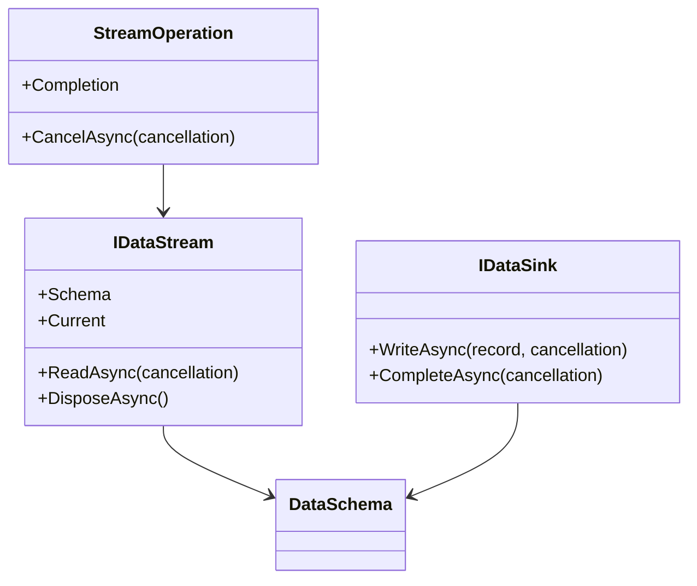

# SPSS-040 — Public API

| Field | Value |
| --- | --- |
| Status | Draft |
| Category | Standards Track |
| Depends on | SPSS-010, SPSS-020, SPSS-030 |
| Updates | None |
| Last updated | 2026-07-23 |

## Abstract

This document defines the required shape and semantics of the language-neutral StreamPipe SDK surface, together with the initial .NET mapping. It deliberately excludes wire-protocol methods; frame encoding and session negotiation remain internal until their specifications are accepted.

## Scope

The public API covers data streams, schemas, records, operations, lifecycle, errors, cancellation, and extension boundaries. It does not define an HTTP endpoint API, protocol frame API, authentication API, or database adapter API.

## API design rules

`REQ-API-001` — A public SDK API **MUST** expose data streaming without requiring callers to allocate a full result collection.

`REQ-API-002` — Public API contracts **MUST** distinguish schema, record data, successful completion, cancellation, and failure.

`REQ-API-003` — Public APIs **MUST NOT** expose transport byte buffers as the ordinary application data model.

`REQ-API-004` — Public APIs **MUST** allow cancellation to be supplied by the caller for every potentially blocking operation.

`REQ-API-005` — Public API changes that break source or behavioral compatibility **MUST** require a documented major-version or migration policy.

## Core contracts

Every language SDK exposes concepts equivalent to `DataSchema`, `DataField`, `ColumnValue`, `IDataStream`, `IDataSink`, `StreamOperation`, and `StreamPipeException`. Names may follow language conventions, but their semantics must conform to this document.



## Data schema and values

`DataSchema` and `DataField` must represent the schema from SPSS-020. `ColumnValue` represents one field value, including null. A public schema is immutable once it has been associated with a stream.

`REQ-API-006` — A public schema object **MUST** preserve field order, field name, logical type, nullability, and metadata.

`REQ-API-007` — A public value API **MUST** represent null separately from an empty or default value.

`REQ-API-008` — A public schema or value object **MUST NOT** be mutable in a way that changes an active stream’s meaning.

## IDataStream

`IDataStream` is the row-oriented, pull-based logical stream contract. It exposes a schema before the first successful read. `ReadAsync` returns `true` exactly when `Current` contains one record; it returns `false` only after successful end-of-stream. Cancellation and failure are reported by cancellation or exception, not `false`.

**Normative .NET shape:**

```csharp
public interface IDataStream : IAsyncDisposable
{
    DataSchema Schema { get; }
    ValueTask<bool> ReadAsync(CancellationToken cancellationToken = default);
    ReadOnlySpan<ColumnValue> Current { get; }
}
```

`REQ-API-009` — `IDataStream.Schema` **MUST** be available before the first record is read.

`REQ-API-010` — `IDataStream.Current` **MUST** be valid only after a successful `ReadAsync` and until the next read, disposal, or terminal transition.

`REQ-API-011` — `IDataStream.ReadAsync` **MUST NOT** return `false` for cancellation, failure, invalid data, or a resource-limit violation.

`REQ-API-012` — An implementation **MUST NOT** allow concurrent `ReadAsync` calls on the same stream unless a later API explicitly states otherwise.

`REQ-API-013` — Disposing an active stream **MUST** release local resources and request cancellation of unfinished underlying work.

## IDataSink

`IDataSink` is the push-based counterpart used by upload and bulk-ingest adapters. It has a stable schema and accepts records in schema order. Completion is explicit so that a caller can distinguish a completed write from an abandoned sink.

```csharp
public interface IDataSink : IAsyncDisposable
{
    DataSchema Schema { get; }
    ValueTask WriteAsync(ReadOnlyMemory<ColumnValue> record,
                         CancellationToken cancellationToken = default);
    ValueTask CompleteAsync(CancellationToken cancellationToken = default);
}
```

`REQ-API-014` — A sink **MUST** validate record length, field order, nullability, and logical type before accepting a record as written.

`REQ-API-015` — A sink **MUST** reject writes after successful completion, failure, cancellation, or disposal.

`REQ-API-016` — `CompleteAsync` **MUST** be idempotent after successful completion.

## Operations and errors

An operation represents a client or server session started through an SDK composition API. Its completion is awaitable and reports success, cancellation, or a typed error. `StreamPipeException` is the common base for protocol, transport, format, resource-limit, and state errors.

`REQ-API-017` — A public error **MUST** expose a stable machine-readable category and a human-readable message.

`REQ-API-018` — A public error **MUST NOT** expose payload bytes, credentials, or transport secrets by default.

`REQ-API-019` — A caller **MUST** be able to cancel an operation without constructing protocol-specific cancellation frames.

## Factories and extensions

SDK composition APIs create streams and operations from registered transport, format, and data-adapter capabilities. Public APIs may use dependency injection but must not require one dependency-injection framework.

`REQ-API-020` — An SDK **MUST** fail deterministically when no registered capability can satisfy a requested transport or format.

`REQ-API-021` — An extension registration **MUST NOT** alter the behavior of an existing active stream.

`REQ-API-022` — A public API **MUST NOT** expose an adapter as supported until it has passed applicable conformance tests.

## Compatibility considerations

Adding optional API members is compatible when it does not change existing behavior. Removing members, changing lifecycle semantics, mutating schema, or interpreting `false` differently from end-of-stream is incompatible.

## Security considerations

Callers control operation inputs but transports and peers may be untrusted. Implementations must validate schemas and values before passing them into application adapters; errors must follow the redaction rule above.

## Performance considerations

The row-oriented API is a universal adapter contract, not necessarily the fastest format-native path. SDKs may provide optimized batch or Arrow APIs, provided they preserve the same ownership, cancellation, and bounded-memory rules.

## References

- [SPSS-020 — Data Model](SPSS-020-Data-Model.md)
- [SPSS-030 — Memory Model](SPSS-030-Memory-Model.md)
- [SPSS-100 — Wire Protocol](SPSS-100-Wire-Protocol.md) (planned)
